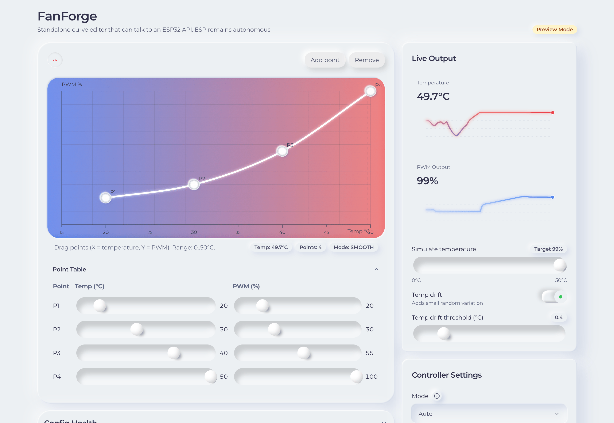
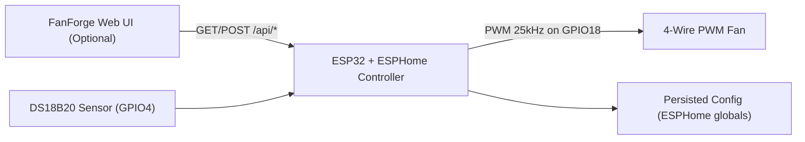

<p align="center">
  
</p>

<h1 align="center">FanForge</h1>
<p align="center"><strong>Embedded Fan Control Platform for ESP32 + ESPHome</strong></p>
<p align="center">
Firmware-first thermal control with an optional web operations console and a documented HTTP API contract.
</p>

<p align="center">
  <a href="firmware/esphome/fanforge-controller.yaml">
    
  </a>
  <a href="src/FanForgePreview.tsx">
    
  </a>
  <a href="openapi/esp32-api.yaml">
    
  </a>
  <a href="docker-compose.yml">
    
  </a>
  
</p>

<p align="center">
  
</p>

## Executive Summary

FanForge is a control system for PWM fan management on ESP32/ESPHome hardware. It provides:

- Autonomous on-device control logic
- A production-style browser UI for curve editing, validation, and telemetry
- A versioned API contract for external integrations

The controller is the source of truth. The web UI is intentionally optional.

## Core Design Principle

FanForge firmware continues operating from persisted on-device configuration even when:

- The web UI is closed
- The UI container is unavailable
- The local network path to the UI is interrupted

## System Architecture



## Capability Overview

- Draggable fan-curve editor with `linear` and `smooth` interpolation
- Configuration validation before apply
- Real-time temperature and PWM telemetry
- Operational modes: `auto`, `manual`, `off`
- Safety controls: PWM min/max, slew-rate limiting, and temperature failsafe
- Firmware-side noise handling (EMA filtering, deadband, and failsafe hysteresis)

## Quick Start

### Option A: Run Web UI via Docker

```bash
docker compose up --build
```

Open [http://localhost:8080](http://localhost:8080).

### Option B: Local UI Development

```bash
npm install
npm run dev
```

## Firmware Deployment

Primary firmware artifacts:

- `firmware/esphome/fanforge-controller.yaml`
- `firmware/esphome/fanforge_api.h`

Reference hardware mapping in the starter firmware:

- `DS18B20` temperature sensor on `GPIO4` (OneWire)
- 4-wire fan PWM output on `GPIO18` at `25kHz`

Control loop cadence:

- `fanforge_control_tick()` is executed every `200ms`

## API Contract

Canonical API schema:

- `openapi/esp32-api.yaml`

Implemented endpoints:

- `GET /api/status`
- `GET /api/config`
- `POST /api/config`

### `GET /api/status` response (summary)

- `temp_c`
- `pwm_pct`
- `mode`
- `smoothing_mode`
- `last_update_ms`

### `GET/POST /api/config` object (summary)

- `mode`
- `smoothing_mode`
- `points[]` (`{ t, p }`)
- `min_pwm`
- `max_pwm`
- `slew_pct_per_sec`
- `failsafe_temp`
- `failsafe_pwm`

## Network and CORS Guidance

If the browser UI connects directly to the device on a different origin (for example `http://localhost:8080` to `http://esp32.local`), configure CORS headers in firmware to match your network policy.

## Repository Structure

- `src/`: web UI source
- `firmware/esphome/`: ESPHome configuration and API/control logic
- `openapi/esp32-api.yaml`: OpenAPI contract
- `Dockerfile` and `docker-compose.yml`: containerized UI runtime
- `docs/assets/`: README media assets

## Contribution

Contributions are welcome for firmware controls, UI ergonomics, and API evolution. When proposing changes, keep firmware autonomy and API compatibility as first-order constraints.
